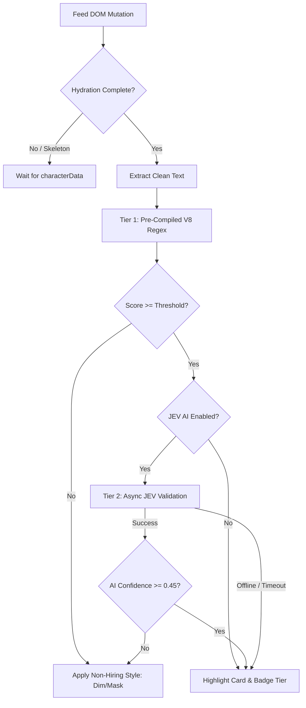

# JEV - Job Hiring Content Detector 🚀

[](https://developer.chrome.com/docs/extensions/mv3/intro/)
[](LICENSE)
[](#architecture)
[](#supported-platforms)

> **Supercharge your job hunt on social feeds.**
> Detect, highlight, and isolate hiring opportunities on LinkedIn, X.com (Twitter), Reddit, and job boards with ultra-fast, local Regex heuristics (<0.003ms) and optional JEV AI semantic validation.

---

## 🌟 Key Features

- **⚡ Zero-Latency Detection (<0.003ms)**: Powered by a pre-compiled V8 single-pass DFA regex engine for instant, flicker-free post detection without any cloud dependency.
- **🎯 Intelligent Post Outlines**: Outlines verified hiring posts in glowing Deep Teal (`#00876c`) and badges them by relevance confidence tier (Strong, Notable, Possible).
- **🛡️ Feed & Virtual-Scroll Resilient**: Works seamlessly on modern dynamic feeds (LinkedIn SDUI, X.com React timelines) without breaking infinite scroll, layout metrics, or triggering hydration loops.
- **👁️ Multiple Privacy & Focus Modes**:
  1. **Highlight Only**: Accentuate matching hiring posts while leaving non-matching posts intact.
  2. **Highlight & Filter (Compact Gray Boxes)**: Mask non-hiring noise behind sleek clickable gray preview bars.
  3. **Highlight & Dim/Blackout**: Heavily fade out non-job content to focus purely on active leads.
- **🤖 Tiered Hybrid AI (Optional JEV)**: Offline-first architecture. If JEV AI is enabled, borderline posts are verified via deep semantic reasoning, with automatic, graceful fallback to local regex if offline or rate-limited.
- **🔒 AES-256-GCM Secure**: Any user-provided API credentials are encrypted with native Chromium WebCrypto API before writing to local storage. Zero telemetry, zero tracking, zero external scripts.

---

## 📸 Visual Showcase

### 1. Highlight & Hide (Compact Gray Box Filter)
*Non-hiring posts are cleanly masked behind minimal preview bars, keeping your feed laser-focused while preserving native virtual scroll mechanics.*


---

### 2. Highlight & Blackout / Dim Mode
*Dim out all irrelevant posts to effortlessly scan through feeds and catch key job updates in high contrast.*


---

### 3. Highlight Only Mode
*Subtly outline active hiring opportunities in Deep Teal while preserving the original feed layout and context.*


---

## 🛠️ Installation & Setup

### Install in Developer Mode (Google Chrome / Brave / Edge)

1. Clone or download this repository:
   ```bash
   git clone https://github.com/pareshbhangale/JEV---Job-Hiring-Content-Detector.git
   ```
2. Open your browser and navigate to the Extensions management page:
   - **Chrome**: `chrome://extensions`
   - **Brave**: `brave://extensions`
   - **Edge**: `edge://extensions`
3. Toggle on **Developer mode** in the top right corner.
4. Click **Load unpacked**.
5. Select the `apps/jev-job-hiring-content-detector/` directory (where `manifest.json` is located).
6. Pin the extension to your toolbar and browse LinkedIn or X.com!

---

## 🕹️ Usage & Controls

Click the extension icon in your browser toolbar to open the control drawer:

| Control | Description |
| :--- | :--- |
| **Master Switch** | Turn the detector on or off globally for the active tab. |
| **Highlight Matches** | Render glowing Deep Teal cards and match indicators. |
| **Filter Non-Hiring** | Collapse non-job posts into compact gray boxes. Click any gray box to preview. |
| **Dim Background** | Reduce opacity and apply grayscale to non-matching posts. |
| **AI Verification (JEV)** | *(Optional)* Perform secondary LLM scoring for subtle or unconventional hiring posts. |
| **Rescan & Clear** | Trigger instant re-indexing or reset visual markers on demand. |
| **Export Scan (⚙️)** | Download structured JSON containing detected posts, scores, and timestamps. |

---

## 🏗️ Architecture & Technical Design

The extension employs an offline-first **Tiered Hybrid Evaluation** model:



### Supported Platforms
- **LinkedIn**: Supports both SDUI (2025/2026 flagship feed) and Legacy (`feed-shared-update-v2`) architectures.
- **X.com / Twitter**: Full support for React virtual timeline (`article[data-testid="tweet"]`) with hydration-aware text extraction.
- **Reddit**: Modern Shreddit UI (`shreddit-post`) and legacy desktop layouts.
- **Generic Articles / Web Feeds**: Standard semantic HTML5 `<article>` elements.

---

## 🔒 Privacy & Security

- **Zero Data Collection**: No browsing history, queries, or post contents leave your browser.
- **No Third-Party Analytics**: Clean, transparent code with zero tracking libraries.
- **Encrypted Local Storage**: Optional API keys are stored using `AES-256-GCM` with PBKDF2 key derivation via Chromium's native `window.crypto.subtle`.

---

## 🤝 Contributing

Contributions are very welcome! Please feel free to submit issues or pull requests.
Check out [CONTRIBUTING.md](docs/contributing.md) for code standards and setup guidelines.

---

## 📄 License

Distributed under the **PolyForm Noncommercial License 1.0.0**.
- **Free for Personal Use**: Anyone may use, study, and modify this extension for personal job hunting or educational purposes for free.
- **Commercial Use**: Any commercial use (e.g. by recruitment agencies, corporate staffing, or for-profit tools) requires a separate commercial license. See [LICENSE](LICENSE) for full details.
